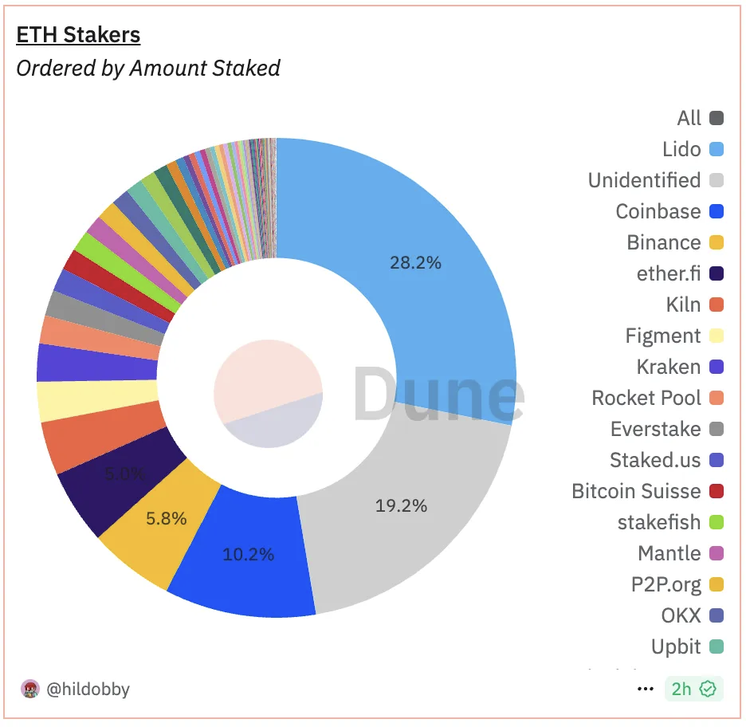
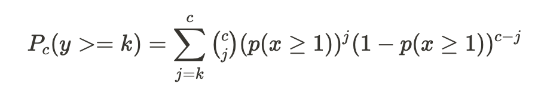
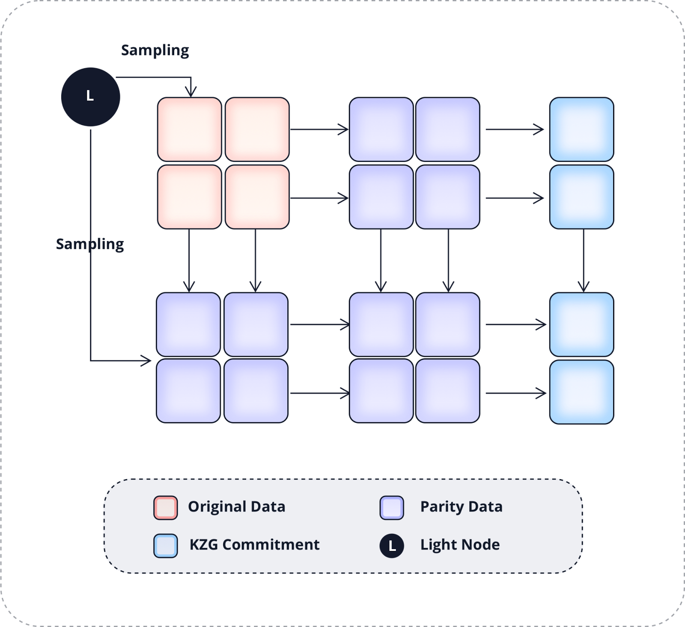

Dill
==============

***A new paradigm chain of maximum scalability, sovereignty and decentralization***

**Dill Foundation**

*Version 0.1*

*Feb 13, 2025*

## Abstract

We propose Dill, a new paradigm chain based on a modular and sharded architecture, capable of achieving maximum scalability, sovereignty, and decentralization:

- Maximum scalability: Dill supports up to 800,000 TPS, which is approximately 100 times the scalability of existing high-performance monolithic chains.
- Maximum sovereignty: Each application deployed on Dill has its own dedicated execution environment, allowing it to capture the value of the execution layer while enabling custom execution environments.
- Maximum decentralization: Dill supports up to 1 million validators while maintaining low barriers for staking and node operation, making it accessible to solo stakers.

The protocol combines the advantages of both solutions by adopting a modular internal structure while maintaining an externally unified architecture. This approach ensures the high scalability, sovereignty and decentralization that modularity brings while avoiding the ecosystem fragmentation caused by Layer 2.

# 1. Introduction

Ethereum revolutionized blockchain by separating application logic through virtual machines, transforming blockchains from single-purpose systems into programmable platforms for smart contracts. This innovation allowed decentralized applications (dApps) to leverage blockchain security at minimal cost, leading to widespread dApp adoption. However, two critical challenges emerged:

- The blockchain trilemma—balancing scalability, security, and decentralization—limits blockchain systems to achieving only two of these three properties at a time. This often results in either scalability or decentralization being prioritized, while the other is sacrificed.
- Applications lost sovereignty as they transitioned from dedicated resources to shared blockchain infrastructure, leading to the phenomenon of "fat protocols, thin applications," where the value and functionality of applications were constrained by the limitations of the underlying platform.

In response to these challenges, Ethereum initially attempted to solve the trilemma with sharding, but the monolithic design proved unfit for implementation. As a result, Ethereum shifted to a rollup-centric modular solution to address scalability, at the cost of ecosystem fragmentation. On the other hand, high-performance chains like Solana continue to stick with monolithic chain design. achieving higher scalability by sacrificing decentralization, supporting thousands to tens of thousands of TPS.

Both approaches have their respective strengths and weaknesses:

Ethereum's Rollup-Centric Solution [1]
- Advantages:
  - Solves scalability issues of the execution layer while maintaining decentralization.
- Disadvantages:
  - Layer 2 leads to fragmentation of the entire ecosystem.
  - Ethereum's influence on the application ecosystem and end users diminishes.

Solana's High-Performance Monolithic Solution [2]
- Advantages:
  - Ensures ecosystem unity.
  - No “intermediaries” between the platform and application ecosystem.
- Disadvantages:
  - Centralization issues.
  - Scalability is limited, unable to support tens of thousands of TPS.

Dill combines the advantages of both solutions by adopting a modular internal structure while maintaining an externally unified architecture. This approach ensures **high scalability and decentralization**, while avoiding the ecosystem fragmentation seen in Layer 2 solutions.

Besides scalability, another major motivation for the development of Dill is the increasing demand for **sovereignty** and customizability for dApps. General-purpose blockchains have become a limitation for the development of dApps. For example, Uniswap incurs over $1 billion gas fees annually on Ethereum. By adopting the Unichain application chain model, Uniswap achieves greater scalability and sovereignty. It significantly reduces execution gas fees, captures the value of the execution layer, and incorporates features such as built-in MEV redistribution mechanisms, millisecond-level pre-confirmation times, and transparent transaction ordering—features that general-purpose blockchains cannot support.

With the addition of AI agents, on-chain applications will experience a significant increase in request volume. Current monolithic high-performance chains can only support a few thousand to 10,000 TPS and cannot accommodate application-specific customizations. The scalability and sovereignty limitations of general-purpose blockchains will become a barrier to the mass adoption of applications. It has become clear that, in addition to scalability, sovereignty is crucial for mass adoption.

Dill is a new paradigm chain built on modular and sharding technologies. The entire chain consists of the following modules:

- Base Layer: This is a DA network similar to Celestia, consisting of a consensus layer and a data layer. It is composed of hundreds of thousands to millions of validators, ensuring the security of the entire chain by maintaining consensus and data availability.
- Settlement Layer: Built on top of the base layer, this layer is responsible for settlement, and proofs aggregation.
- Execution Layer: The execution layer is made up of individual sequencers, with each application having its own dedicated sequencer.
- Bridge: A minimal-trust native verification bridge ensures interoperability between applications.

 
Figure: Dill Architecture

Recent advancements in modular technologies like rollups and data availability (DA) have made the implementation of sharding feasible, opening up new design philosophies for blockchain architecture.  Modularity enhances blockchain scalability not only through the "divide and conquer" approach but also by making sharding, which was previously difficult to implement on monolithic chains, a reality. Sharding is considered as the ultimate solution to the blockchain trilemma. It allows blockchains to significantly scale while preserving decentralization, increasing scalability by tens or even hundreds of times. And below is how Dill implements sharding in each layer:

- Consensus Layer: By introducing a committee mechanism for validators, Dill shards the consensus layer by slots, supporting up to a million validators. Combined with Dill's full and light validator modes, it achieves 3-slot fast finality (36 seconds).
- Data Layer: Using 2D EC and KZG-based DAS and subnet sharding, Dill supports a maximum of 512MB blob blocks per slot.
- Execution Layer: Through dedicated execution environments for each application, Dill effectively implements sharding at the application level on the execution layer, providing infinite scalability. This app-dedicated sequencer model provides sovereignty to applications in the lightest way possible.

In the following sections, we will introduce the consensus layer, data layer, and execution layer in details.

# 2. Consensus Layer

## 2.1 Goal

Dill's consensus layer aims to achieve three key goals:

* Friendly to solo stakers (Decentralization)  
* Fast finality (Scalability)  
* High economic security (Security)

## 2.2 The Blockchain Trilemma

In designing POS blockchain consensus mechanisms, decentralization, fast finality, and high economic security form an inherent trilemma. These three core attributes involve trade-offs that must be optimized based on specific application scenarios.

Existing blockchain solutions adopt various trade-off strategies:

* High-performance blockchains like Solana achieve millisecond-level finality times, but their validator node count is typically limited to between 100 and 1,000, with high hardware requirements for nodes.  
* Ethereum supports over 1 million validator nodes, with an average finality time of approximately 15 minutes (64–95 slots, with each slot lasting 12 seconds).  
* Dill aims to achieve second-level finality while maximizing the number of validator nodes, the goal is to support over 1 million validators.  
  * By leveraging pre-confirmation technology, Dill ensures millisecond-level block production and confirmation on the execution layer, reducing the reliance on the base layer for finality times.  
  * Second-level finality offers a good user experience for interoperability and fund withdrawal.

## 2.3 Committee: Sharding of the Consensus Layer

Supporting 1 million validator nodes generates a massive amount of signatures and data, which current technology cannot process within a single slot. By dividing validators into committees and distributing them across multiple slots, the number of validators per slot can be significantly reduced. Combined with BLS signature aggregation, this approach further minimizes the amount of signature data per node, enabling a single slot to support tens of thousands of validators (currently, Ethereum supports approximately 32,000 validators per slot).

**Why Committees Are Secure**  
Committee members are randomly selected at regular intervals. The larger the committee size, the more secure it becomes. Assuming a single entity controls more than 1/3 of the network nodes (enough to block finality), the probability of this entity controlling 2/3 or more of the nodes in any single committee (compromising the chain's security) is less than 2^-80 if the committee size exceeds 231\. Even with a block production time to be one second, the expected time for such an event to occur far exceeds the age of the universe. Further analysis demonstrates that committees offer security levels comparable to scenarios without sharding. 

**Finality Solution Based on Committees**  
If the validator set is divided across 32 (with each slot supporting 32,000 validators, allowing 1 million validators for 32 slots), then the validators per slot account for only 1/32  of the global set. In extreme cases, if a single entity controls 51% of the nodes, they would need only 1/32 of the original cost to attack the chain (e.g., chain reorganization, censorship, or delaying finality). As a result, a simple slot-based committee division significantly reduces the economic security of the chain.

**Improving Economic Security for Single Slots**

1. Lower the likelihood of a single entity controlling 51% of the nodes.  
2. Increase the amount of staked tokens within a single slot to raise the slashing cost of an attack.

To put this into perspectives, currently, Lido accounts for nearly 30% of Ethereum's staked tokens, primarily due to two factors: 1\) High staking requirements and maintenance costs make it unfriendly for solo stakers. 2\) Liquid staking pools exhibit significant network effects, favoring centralization and top players.

  

Dill addresses these issues through the following strategies: 

1\. Introduce a light staking layer with lower staking requirements designed to be solo staker friendly, ensuring network decentralization.

2\. Introduce a heavy staking layer targeting staking pools, centralized exchanges (CEXs), and other institutions, enhancing the economic security within single slots.

3\. Implement an innovative decentralized staking pool mechanism to mitigate the economies of scale from the dominant entities (details to be elaborated later).

### 2.4 Two-tiered Staking Model Analysis

In most mainstream blockchain networks, institutions like liquid staking/restaking platforms, CEXs, and staking pools dominate the staking market. These institutions hold significantly more tokens than solo stakers combined. For the two-tiered staking model, we assume that the heavy staking layer has 64 times the staking amount of the light staking layer. 

If the total staked tokens by light stakers and heavy stakers are equal, the network would have 1 million light-layer validators and approximately 16,000 heavy-layer full validators.

Light-layer validators and heavy-layer validators each form their own committees, spanning a total of 64 slots. Unlike the approach of evenly dividing committees across slots, Dill employs a method that limits the number of validators per slot. Assuming each slot selects up to 16,000 validators from both the light and heavy staking layers (for a total of 32,000 per slot), light-layer validators are selected on average once every 64 slots, while heavy-layer validators are selected every time.

Light-layer and heavy-layer validators participate in consensus voting separately. Finality is only achieved when both light-layer and heavy-layer validators individually reach a 2/3 vote. To reorganize the chain, an attacker would need to control both layers simultaneously. Since the heavy staking layer accounts for 50% of the total staked tokens, the economic security within a single slot is significantly enhanced.

## 2.5 Rebalancing and Optimization of the Two-tiered Staking Mechanism

Full validators play a key role in enhancing the economic security of individual slots, while light validators ensure the network's decentralization. To achieve optimal performance for the Dill blockchain, it is essential to maintain a reasonable staking ratio between these two layers.

Dill has determined an ideal staking ratio where the total amount staked by full validators to that by light validators is 1:1, meaning the heavy and light layers each account for 50% of the total staked tokens. This balanced configuration maximizes the staking requirement to control either layer individually.

To maintain this balance, Dill employs a dynamic incentive mechanism: when the staking ratio deviates from the target, the staking yield is adjusted to guide capital flow and restore equilibrium. For example, if the light-layer staking exceeds 50%, its yield per unit capital will decrease accordingly, incentivizing more capital to flow to the heavy layer until the system returns to equilibrium. This adaptive mechanism ensures the system's long-term stability.

**Node Roles in the Two-tiered Staking Model**  
The two-tiered staking mechanism allows for differentiated roles between light validators and full validators, further enhancing the system's scalability and decentralization:

* **Full Validators**: Operate as full nodes, responsible for state maintenance, block production, and consensus voting.  
* **Light Validators**: Designed as stateless nodes, focusing on state validation, data availability sampling (DAS), and consensus voting.

## 2.6 Stateless Light Validators

As blockchain networks operate over time, the size of node state data grows exponentially, prolonging the initial synchronization period for new nodes to several months. Meanwhile, the increasing hardware requirements significantly raise node operation costs.

Dill's base layer focuses solely on consensus mechanisms and data networking, completely decoupled from the execution layer. This design offers notable advantages:

1. By eliminating the computational complexity and state management needed by smart contracts, the system's state is significantly simplified.  
2. This reduces hardware requirements for node maintenance and shortens synchronization times.

Under the two-tiered staking architecture, light validators take this further by fully adopting a stateless design, optimizing scalability and minimizing operational costs.

### 2.6.1 Verkle Tree

The Verkle Tree is an innovative, provable data structure that serves as an advanced version of the Merkle Tree. Its defining feature is the use of polynomial commitment mechanisms. Unlike traditional Merkle Trees, the Verkle Tree does not rely on sibling nodes to generate proofs. This characteristic significantly enhances proof space efficiency in scenarios involving large-scale tree structures.

Another key advantage of the polynomial commitment mechanism lies in its state update capability: the system can calculate a new state root directly based on the state changes of a single node without accessing sibling node states. This feature enables Verkle Trees to effectively support the implementation of stateless nodes. In practical applications, nodes only need to combine the state root of the current block, new transaction blocks, and the current state of relevant addresses to compute and verify the correctness of the new state root. 

In Dill's architectural design, the decoupling of the execution layer simplifies state computation. This characteristic provides a solid foundation for the practical application of Verkle Trees, significantly reducing the complexity of engineering implementation.

## 2.7 Three-Slot Finality

Dill adopts a 3-slot finality consensus mechanism based on LMD GHOST and Casper FFG. Compared to the single-slot finality approach, this mechanism increases finality time from 28 seconds to 36 seconds but offers the following advantages:

* **Reduced Validator Requirements per Slot**:  
  Under equivalent economic security, the 3-slot finality mechanism requires only one-third of the validators per slot compared to single-slot finality. This supports higher staking rates. Even if the staking rate doubles, only two-thirds of the validators are needed (e.g., Ethereum's current staking rate is around 30%, and Solana's is about 60%). This significantly enhances the network's economic security.  
* **Optimized Throughput**:  
  Single-slot finality requires two additional voting rounds, extending slot latency from 12 seconds to 28 seconds (8 seconds per round), reducing the data layer's throughput by about 60%. As maintaining high throughput is a core performance metric for Dill, the 3-slot finality mechanism helps preserve this crucial capability.  
* **Slot Latency Optimization**:  
  Requiring fewer validators per slot creates the potential to further reduce slot latency. This improvement not only shortens finality times but also boosts the network's overall data throughput.

# 3. Data Layer

The data layer ensures the complete publication of data blocks across the network. In a modular architecture, the data layer receives and processes transaction blocks packaged by the execution layer, providing reliable data download and state reconstruction capabilities for execution-layer validators and users.

Throughput, as the core performance metric of the data layer, directly impacts the overall efficiency of the execution layer. Dill's execution layer employs efficient data compression techniques, packaging transaction data into blob blocks for transmission to the data layer. Leveraging zero-knowledge proof (zk proof) technology, individual transactions can be compressed to as small as 13 bytes. Under Dill's **10MB/s** throughput performance target, the execution layer achieves an exceptional performance of approximately **800,000 TPS.**

The data layer's throughput is primarily constrained by network transmission and verification performance. Assuming a 12-second finality per slot, a 10MB/s throughput corresponds to a block size of 128MB. By comparison:

* Solana's current blocks are approximately 0.5–1MB (handling 2,500–5,000 transactions averaging 200B).  
* Ethereum, post-EIP-4844 upgrade, still operates with block sizes under 1MB, translating to a throughput of less than 100KB/s at a 12-second slot time.

Dill aims to achieve a high-throughput data layer architecture on a decentralized network of 1 million validator nodes, maintaining compatibility with existing hardware and network bandwidth requirements through innovative technical solutions.

## 3.1 DAS

The execution layer's state correctness is ensured by the settlement layer, meaning the data layer does not need to parse or execute transaction data. Leveraging this characteristic, nodes can verify the integrity of large blocks without downloading the entire dataset. By using DAS (Data Availability Sampling), only partial data needs to be extracted to confirm data integrity, enabling large-block integrity verification on standard machines.

DAS relies on two key technologies: EC (Erasure Coding) and KZG.

### 3.1.1 1D EC

For data of size 1×m, 1D EC expands it to m+m. This allows recovery of the original data even if up to m segments are hidden. Therefore, to make the data unavailable, an attacker must hide at least m+1 segments.

In a 1D EC hidden data detection scenario, the probability of a single DAS node detecting at least one hidden segment after s samples is:

Assuming m=64, when s\>33, the probability of failing to detect hidden data is less than 10^-13. With a block time of 12 seconds, this means a false-negative event would occur approximately once in 4 million years.

  
 
Figure: 1D EC Encoding

  

In a scenario with n×m data, assuming n=1024, using 1D EC, a malicious node only needs to hide one row of m+1 data units to make the data unavailable. DAS nodes must sample an entire column to have a 1/2 chance of detecting hidden data. As n increases, the amount of data needed for sampling also increases.

### 3.1.2 2D EC

2D EC expands data in both row and column directions. To hide one point of data, an attacker must simultaneously hide data in both row and column directions. Hidden row data must further hide column data, and hidden column data must further hide row data. Ultimately, even hiding a single data point requires hiding at least 1/4 of the data.

 
Figure : 2D EC Encoding  

  

In an n×m dataset with 2D EC, the probability of a DAS node detecting at least one hidden point after s samples is:  

Assuming n=1024 and m=64, when s\>96, the probability of failing to detect hidden data is less than 10^−13.

In the 2D EC scenario, a DAS node only needs to sample one data point, significantly reducing the amount of data sampled compared to the column-based sampling required in 1D EC. For n=1024, the data sampled in 2D EC is less than 1/300 of the data sampled in 1D EC (96/33×1024).

### 3.1.3 Multi-DAS Sampling

Dill employs a multi-DAS node sampling approach. In the event of data unavailability, more than 1/3 of the nodes must detect the unavailability. The probability of at least k out of c sampling nodes detecting data unavailability is:

Assuming 10 nodes perform sampling simultaneously, with each node having a 10^−13 probability of failing to detect hidden data, the probability that 4 or more nodes detect the issue exceeds 1-10^−68. Thus, the probability of failing to detect data unavailability (with only 0–3 nodes identifying the issue) is less than 10^−68, which is far less than 10^−13.

### 3.1.4 KZG Polynomial Commitment

After a DAS node samples a small portion of data, it must verify whether the data belongs to the original published dataset. The sampled node provides proof for this data, which is commonly done using Merkle Tree proofs. However, Merkle Tree proofs have two significant drawbacks:

1. The proof size increases with the size of the Merkle Tree.  
2. In the EC extension scenario, Merkle Tree proofs cannot verify the relationship between the extended data and the original data. This process relies on fraud proofs, which reduces security and may take days to complete the data availability verification.

Dill employs KZG polynomial commitments to address these issues:

1. KZG polynomial commitment proofs have a fixed size, with each proof being 48 bytes.  
2. KZG polynomial commitments can validate the EC extension relationship, effectively ensuring that the extended data is indeed an EC extension of the original data.

 
Figure: DA Sampling by Light Validators

### 3.1.5 Bandwidth and Quantity of DAS Nodes

Assuming the execution layer submits transaction data in blob form, with each blob being 128KiB in size, a single submission can include 1-N blobs (N ≤ 1024). Multiple execution layers can simultaneously submit blob data. The data layer combines up to 1024 blobs from various execution layers into one block, with the original block size capped at 128MiB (12 seconds per slot, 10MB/s throughput). After 2D EC extension, the block size reaches a maximum of 512MiB.

Assuming the sampling granularity of a DAS node for a single cell is 2KiB, with each cell's KZG proof being 48 bytes, and the DAS node performs 96 concurrent samples (with an error probability of less than 10^-13, the total data sampled is: (2KiB+48B)×96=196.5KiB, with a 1MB bandwidth, sampling can be completed within 200ms.

For a 512MiB block:

512MiB / 196.5KiB=2605

A minimum of 2605 DAS nodes is required to cover 512MiB of data, ensuring the complete preservation of both the original and the 2D EC extended data across the sampling nodes.

## 3.2 Subnet Sharding

The process of adding a blob block to the network is divided into three steps:

1. **Build**  
   The proposer packages the blob, performs EC extension, and calculates the KZG commitment and proof.  
2. **Propagate**  
   The proposer propagates the blob in the P2P network.  
3. **Verify**  
   Validators perform DAS sampling on the received blob and cast their votes.

Benchmark for an 8-core CPU (Intel Cascade Lake, 2.0GHz)

|  | size | time(ms) |
| :---- | :---- | :---- |
| Column EC extension (data \+ proof) | 1024 \* 2KiB | 203 |
| Blob commitment calculation	 | 128KiB | 8 |
| Row EC extension (data \+ proof)	 | 128KiB | 242 |
| Verification of a single sample	 | 2KiB | 2 |

Based on the benchmark data:

* In the **build phase**, an 8-core machine can complete the EC extension in both row and column directions, as well as generate proofs, within approximately 200ms.  
* In the **verify phase**, a DAS node with 1MB bandwidth can complete 96 availability samplings and verifications for 128MiB of raw data in just 400ms.

Assume the proposer has an 8-core CPU and 64Mb bandwidth. To complete the **build** and **propagate** phases for a 1024 \* 128KiB blob (where the EC extension and proof generation unit is 2KiB):

**Build Phase:**

The proposer needs to extend 1024 rows and 128 columns and calculate 2048 commitments.  
The total time consumption is:

(243×1024 \+ 203×128 \+ 8×2048) / 1000 \= 291.2 s

**Propagate Phase:**

* Data: 128 MiB×4=512 MiB  
* Proof: (48×2 KiB×128)/1024=12 MiB  
* Commitment: (48×2 KiB)/1024=0.09 MiB

The time to propagate:

(512+12+0.0964)/8=65.5 s

This time accounts only for synchronization to a single validator. Synchronization across all validators in the network would take significantly longer than 65.5s. Even with a 1Gb bandwidth upgrade, completing propagation within a single slot remains extremely challenging.

## 3.3 Achieving Build and Propagate within a Single Slot

Dill achieves a significant reduction in proposer build and propagate time by parallelizing blob data synchronization, EC extension, and KZG commitment and proof generation through a subnet sharding approach.

Dill divides full validators into 128 subnets. For example, with 16,000 full validators, each subnet contains approximately 128 full validator nodes.

 
Figure: Full Validator Joins Subnets, Column Sampling

**Workflow of Blob Data in Subnet Sharding Mode:**

1. Each full validator receives the raw blob data and completes the 1D EC extension locally, generating the KZG commitment and proof. Since different full validators receive different blobs, this process occurs concurrently.  
2. Full validators synchronize the 1D EC-extended blob data within their respective subnets. Each subnet only synchronizes one column of data. Assuming the total raw blob size is 128MiB, the 1D EC extension increases it to 256MiB, and each subnet synchronizes 2MiB of data.  
3. After receiving the column data, full validators complete the 2D EC extension and generate the corresponding KZG proof and commitment locally.  
4. The proposer performs availability sampling and generates the block. The proposer then synchronizes the block's corresponding blob information. Since the full validators already store the blob column data locally, the proposer does not need to synchronize the raw blob data.  
5. The proposer and full validators undergo DAS sampling and verification by DAS nodes.

**Subnet Sharding Optimization for 10MiB Throughput on Standard Machines:**

1. Synchronizing 512MiB of data across the entire network is optimized to synchronize only 2MiB of data within each subnet.  
2. The proposer's task of completing the 2D EC extension and KZG commitment and proof generation for 512MiB of data is reduced to completing only the 1D EC extension and KZG commitment and proof generation for 2MiB of data, which can be completed in approximately 200ms.

# 4. Applications
Beyond Dill's technical architecture, we can explore its potential use cases, particularly in the scalability and sovereignty realms. Below are some of the potential notable use cases:

## 4.1 Agentic Layers
Blockchains provide an ideal environment for AI agent interactions due to their consensus mechanism and programmable intermediate layers. These features enable agents to express and execute actions while ensuring transactions are verifiable by both humans and agents.

On the Dill network, AI agents can create autonomous execution spaces with full control over gas fees and customization. With the decentralized and autonomous nature of these agents, interactions can occur 24/7—both on-chain and off-chain. The highly scalable execution space supports human-to-human, human-to-agent, and agent-to-agent interactions. Agents in different execution spaces can collaborate, leveraging domain-specific expertise to tackle more complex tasks seamlessly.

Using the $Dill token as a common currency, the network fosters a positive economic exchange within the ecosystem, eliminating the need for third-party bridges. This allows expert agents to earn income for their creators in exchange for delegated tasks from others. Agent-to-agent job delegations are also possible through the $Dill token, enabling a free marketplace for agent interactions to thrive as the settlement layer for agentic commerce. Revenue is distributed across the entire execution layer to base layer and to $Dill token holders. With support for up to 1 million solo stackers, this decentralized network empowers individuals and agents alike.

## 4.2 Fully On-Chain Games

The gaming landscape is evolving rapidly with blockchain technology opening new opportunities for both developers and players. Fully on-chain games store all meaningful data on the blockchain, including not just asset ownership, but also game logic and rules. This ensures fairness, transparency, and verifiability, as everything is publicly accessible and immutable. However, despite these advantages, fewer than 15% of blockchain games are fully on-chain, with many facing technical hurdles like scalability, performance, and interoperability. Dill stands out by directly addressing these challenges, offering significant benefits to create smoother, more cost-efficient, and connected on-chain gaming experiences.

Scalability is one of the major hurdles for fully on-chain games. Traditional blockchains, with their long block times, often struggle to handle high player activity, leading to slow transactions and high fees. Dill mitigates this by providing dedicated execution spaces and high throughput, ensuring smooth gameplay even for high-tick rate games like MMORPGs. This infrastructure enables real-time updates and a better user experience, allowing games to scale effectively without compromising performance.

Another hurdle for developers is the lack of control over the underlying execution environment when games are deployed on a shared blockchain. This can lead to lag and inconsistency, especially during network congestion. Dill offers developers sovereignty over their execution space, allowing them to customize it for optimal performance. By decoupling game logic from blockchain constraints, Dill lets developers fine-tune the tick rate and pre-conf , which enhances responsiveness and gives them the flexibility to design complex, high-performance games that would be difficult to achieve with traditional blockchain models. Dill can also satisfy privacy requirements for specific game designs, providing an added layer of flexibility.

Current on-chain games are also hindered by fragmented ecosystems. Players often need different wallets and tokens for each game, creating friction and limiting cross-game interoperability. Dill solves this problem by using its base chain as a shared state for all game updates. With native verifiability, every execution space client is part of Dill's network and has access to the state for each block. This removes fragmented economies and allows players to access all their game assets across different platforms. By enabling seamless asset movement between games, Dill creates a more cohesive ecosystem, unlocking new opportunities for developers and enhancing the player experience. It also unleashes the potential of the creator-content-player flywheel and generates strong network effects for the platform.

In conclusion, Dill's unique offering serves as a catalyst for fully on-chain gaming adoption, addressing the technical challenges and offering a more connected, flexible, and scalable solution for both developers and players.

# 5.Conclusion
The Dill network introduces a new paradigm that maximizes scalability, sovereignty, and decentralization simultaneously. Its base layer is shared across all execution spaces, providing consensus and security for the entire network. With a two-tiered staking architecture, Dill promotes decentralization by lowering both technical and capital barriers to entry. This structure enables up to 1 million solo stakers to participate and secure the network.

Ultimately, Dill aims to align incentives between dApps, users, and validators, creating a dynamic network that accelerates the application layer and paves the way for the next generation of blockchains.  

# References
- [1] https://ethereum.org/en/developers/docs/scaling/
- [2] https://github.com/solana-labs/whitepaper/blob/master/solana-whitepaper-en.pdf